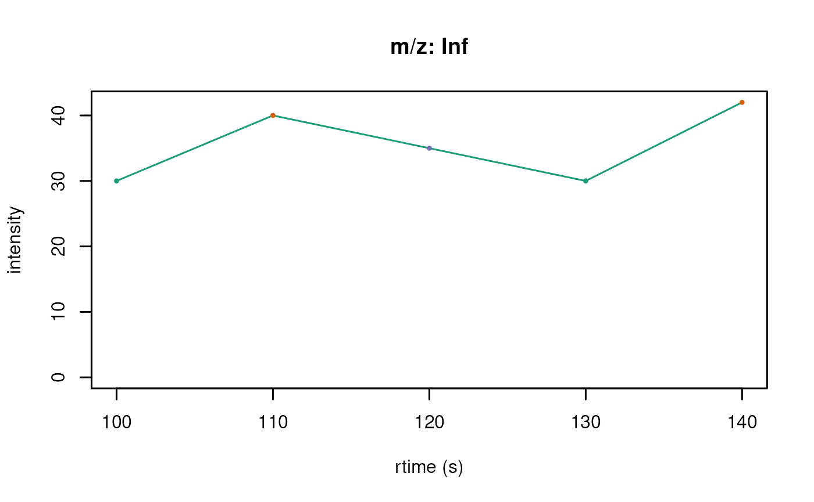
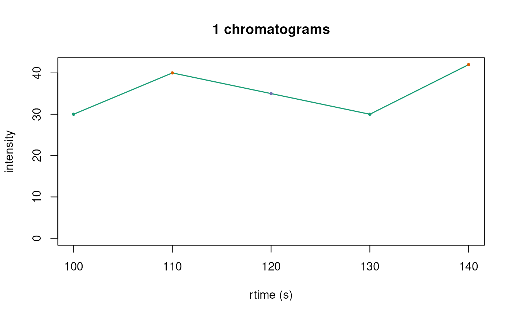
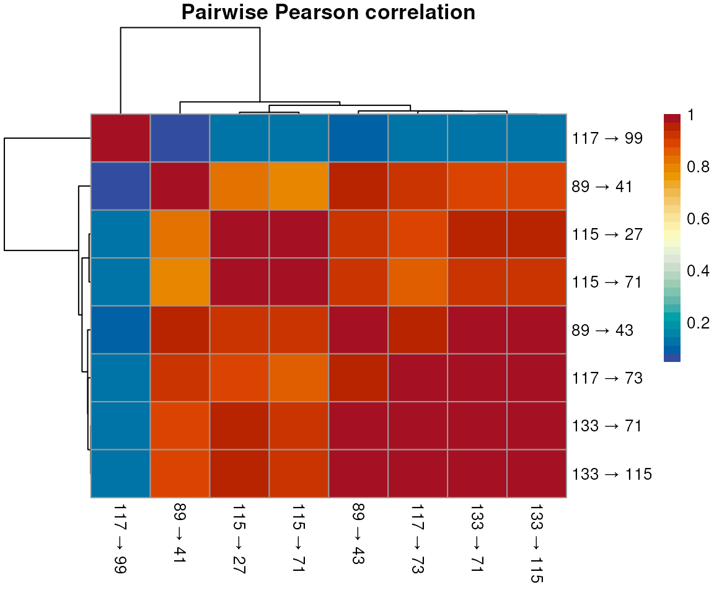

# Using and understanding a Chromatograms object

**Package**: Chromatograms 1.3.3\
**Compiled**: Tue Sep 8 05:44:02 2026

## Introduction

The *Chromatograms* package provides a scalable and flexible
infrastructure to represent, retrieve, and handle chromatographic data.
The `Chromatograms` object offers a standardized interface to access and
manipulate chromatographic data while supporting various ways to store
and retrieve this data through the concept of exchangeable *backends*.
This vignette provides general examples and descriptions for the
*Chromatograms* package.

Contributions to this vignette (content or correction of typos) or
requests for additional details and information are highly welcome,
ideally *via* pull requests or *issues* on the package’s [github
repository](https://github.com/RforMassSpectrometry/Chromatograms).

This vignette describe the structure of a Chromatograms object and the
methods that need to be implemented. In order to see the structure of
the object, the `@` accessor is used to access the different slots. This
is possible because the `Chromatograms` class is defined as an S4 class.
However users should not use the `@` accessor to access the data stored
in a `Chromatograms` object, but instead use the methods defined by the
`Chromatograms` class.

## Installation

The package can be installed with the *BiocManager* package. To install
*BiocManager*, use `install.packages("BiocManager")`, and after that,
use `BiocManager::install("Chromatograms")` to install *Chromatograms*.

## The Chromatograms object

The `Chromatograms` object is a container for chromatographic data,
which includes peaks data (*retention time* and related intensity
values, also\
referred to as *peaks data variables* in the context of `Chromatograms`)
and metadata of individual chromatograms (so-called *chromatogram
variables*). While a core set of chromatogram variables (the
`coreChromatogramsVariables()`) and peaks data variables (the
[`corePeaksVariables()`](https://rformassspectrometry.github.io/Chromatograms/reference/ChromBackend.md))
are guaranteed to be provided by a `Chromatograms`, it is possible to
add arbitrary variables to a `Chromatograms` object.

The `Chromatograms` object is designed to contain chromatographic data
for a (large) set of chromatograms. The data is organized *linearly* and
can be thought of as a list of chromatograms, where each element in the
`Chromatograms` is one chromatogram.

### Available backends

Backends allow to use different *backends* to store chromatographic data
while providing *via* the `Chromatograms` class a unified interface to
use that data. The `Chromatograms` package defines a set of example
backends but any object extending the base `ChromBackend` class could be
used instead. The default backends are:

- `ChromBackendMemory`: the *default* backend to store data in memory.
  Due to its design the `ChromBackendMemory` provides fast access to the
  peaks data and metadata. Since all data is kept in memory, this
  backend has a relatively large memory footprint (depending on the
  data) and is thus not suggested for very large experiments.

- `ChromBackendMzR`: this backend keeps only the chromatographic
  metadata variables in memory and relies on the
  *[mzR](https://bioconductor.org/packages/3.24/mzR)* package to read
  chromatographic peaks (retention time and intensity values) from the
  original mzML files on-demand.

- `ChromBackendSpectra`: this backend generates chromatographic data
  from a `Spectra` object. It can be used to create Total Ion
  Chromatograms (TIC), Base Peak Chromatograms (BPC), or Extracted Ion
  Chromatograms (EICs). It supports both in-memory and file-backed
  `Spectra` objects. The backend uses **factorization** to group spectra
  into chromatograms based on variables like MS level and data origin
  (see details below).

All backends provide a consistent interface through the `Chromatograms`
object, regardless of where or how the data is stored. The
`ChromBackendSpectra` has a special feature: it uses an internal sort
index (`spectraSortIndex`) to maintain retention time order without
physically reordering the underlying `Spectra` object. This is
particularly important for disk-backed `Spectra` objects, as it avoids
loading all data into memory. The sort index is automatically maintained
during subsetting and factorization operations.

### Chromatographic peaks data

The *peaks data variables* information in the `Chromatograms` object can
be accessed using the
[`peaksData()`](https://rformassspectrometry.github.io/Chromatograms/reference/peaksData.md)
function. `peaksData` can be accessed, replaced, and also
filtered/subsetted.

The *core peaks data variables* all have their own accessors and are as
follows:

- `rtime`: A `numeric` vector containing retention time values.
- `intensity`: A `numeric` vector containing intensity values.

### Chromatograms metadata

The metadata of individual chromatograms (so called *chromatograms
variables*), can be accessed using the
[`chromData()`](https://rformassspectrometry.github.io/Chromatograms/reference/chromData.md)
function. The `chromData` can be accessed, replaced, and filtered.

The *core chromatogram variables* all have their own accessor methods,
and it is guaranteed that a value is returned by them (or `NA` if the
information is not available).

The core variables and their data types are (alphabetically ordered):

- `chromIndex`: an `integer` with the index of the chromatogram in the
  original source file (e.g., *mzML* file).
- `collisionEnergy`: for SRM data, `numeric` with the collision energy
  of the precursor.
- `dataOrigin`: optional `character` with the origin of a chromatogram.
- `storageLocation`: `character` defining where the data is (currently)
  stored.
- `msLevel`: `integer` defining the MS level of the data.
- `mz`: optional `numeric` with the (target) m/z value for the
  chromatographic data.
- `mzMin`: optional `numeric` with the lower m/z value of the m/z range
  in case the data (e.g., an extracted ion chromatogram EIC) was
  extracted from a `Chromtagorams` object.
- `mzMax`: optional `numeric` with the upper m/z value of the m/z range.
- `precursorMz`: for SRM data, `numeric` with the target m/z of the
  precursor (parent).
- `precursorMzMin`: for SRM data, optional `numeric` with the lower m/z
  of the precursor’s isolation window.
- `precursorMzMax`: for SRM data, optional `numeric` with the upper m/z
  of the precursor’s isolation window.
- `productMz`: for SRM data, `numeric` with the target m/z of the
  product ion.
- `productMzMin`: for SRM data, optional `numeric` with the lower m/z of
  the product’s isolation window.
- `productMzMax`: for SRM data, optional `numeric` with the upper m/z of
  the product’s isolation window.

For details on the individual variables and their getter/setter
functions, see the help for `Chromatograms`
([`?Chromatograms`](https://rformassspectrometry.github.io/Chromatograms/reference/Chromatograms.md)).
Also, note that these variables are suggested but not required to
characterize a chromatogram.

### Creating `Chromatograms` objects

The simplest way to create a `Chromatograms` object is by defining a
backend ofchoice, which mainly depends on what type of data you have,
and passing that to the `Chromatograms` constructor function. Below we
create such an object for a set of 2 chromatograms, providing their
metadata through a data.frame with the MS level, m/z, and chromatogram
index columns, and peaks data. The metadata includes the MS level, m/z,
and chromatogram index, while the peaks data includes the retention time
and intensity in a list of data.frames.

`# A data.frame with chromatogram variables.`` ``cdata`` ``<-`` `[`data.frame`](https://rdrr.io/r/base/data.frame.html)`(`` `` msLevel ``=`` `[`c`](https://rdrr.io/r/base/c.html)`(``1L``, ``1L``)``,`` `` mz ``=`` `[`c`](https://rdrr.io/r/base/c.html)`(``112.2``, ``123.3``)``,`` `` chromIndex ``=`` `[`c`](https://rdrr.io/r/base/c.html)`(``1L``, ``2L``)`` ``)`` `` ``# Retention time and intensity values for each chromatogram.`` ``pdata`` ``<-`` `[`list`](https://rdrr.io/r/base/list.html)`(`` `` `[`data.frame`](https://rdrr.io/r/base/data.frame.html)`(`` `` rtime ``=`` `[`c`](https://rdrr.io/r/base/c.html)`(``11``, ``12.4``, ``12.8``, ``13.2``, ``14.6``, ``15.1``, ``16.5``)``,`` `` intensity ``=`` `[`c`](https://rdrr.io/r/base/c.html)`(``50.5``, ``123.3``, ``153.6``, ``2354.3``, ``243.4``, ``123.4``, ``83.2``)`` `` ``)``,`` `` `[`data.frame`](https://rdrr.io/r/base/data.frame.html)`(`` `` rtime ``=`` `[`c`](https://rdrr.io/r/base/c.html)`(``45.1``, ``46.2``, ``53``, ``54.2``, ``55.3``, ``56.4``, ``57.5``)``,`` `` intensity ``=`` `[`c`](https://rdrr.io/r/base/c.html)`(``100``, ``180.1``, ``300.45``, ``1400``, ``1200.3``, ``300.2``, ``150.1``)`` `` ``)`` ``)`` `` ``# Create and initialize the backend`` ``be`` ``<-`` `[`backendInitialize`](https://rdrr.io/pkg/ProtGenerics/man/backendInitialize.html)`(`[`ChromBackendMemory`](https://rformassspectrometry.github.io/Chromatograms/reference/ChromBackendMemory.md)`(``)``,`` `` chromData ``=`` ``cdata``, peaksData ``=`` ``pdata`` ``)`` `` ``# Create Chromatograms object`` ``chr`` ``<-`` `[`Chromatograms`](https://rformassspectrometry.github.io/Chromatograms/reference/Chromatograms.md)`(``be``)`` ``chr`

    ## Chromatographic data (Chromatograms) with 2 chromatograms in a ChromBackendMemory backend:
    ##   chromIndex msLevel    mz
    ## 1          1       1 112.2
    ## 2          2       1 123.3
    ## ... 0 more  chromatogram variables/columns
    ## ... 2 peaksData variables

Alternatively, it is possible to import chromatograhic data from mass
spectrometry raw files in mzML/mzXML or CDF format. Below, we create a
`Chromatograms` object from an mzML file and define to use a
`ChromBackendMzR` backend to *store* the data (note that this requires
the *[mzR](https://bioconductor.org/packages/3.24/mzR)* package to be
installed). This backend, specifically designed for raw LC-MS data,
keeps only a subset of chromatogram variables in memory while reading
the retention time and intensity values from the original data files
only on demand. See section [Backends](#backends) for more details on
backends and their properties.

[`library`](https://rdrr.io/r/base/library.html)`(`[`MsDataHub`](https://rformassspectrometry.github.io/MsDataHub)`)`` ``MRM_file`` ``<-`` `[`MRM.standmix.5.mzML`](https://rformassspectrometry.github.io/MsDataHub/reference/MRM.html)`(``)`

    ## see ?MsDataHub and browseVignettes('MsDataHub') for documentation

    ## loading from cache

`be`` ``<-`` `[`backendInitialize`](https://rdrr.io/pkg/ProtGenerics/man/backendInitialize.html)`(`[`ChromBackendMzR`](https://rformassspectrometry.github.io/Chromatograms/reference/ChromBackendMzR.md)`(``)``,`` `` files ``=`` ``MRM_file``,`` `` BPPARAM ``=`` `[`SerialParam`](https://rdrr.io/pkg/BiocParallel/man/SerialParam-class.html)`(``)`` ``)`` `` ``chr_mzr`` ``<-`` `[`Chromatograms`](https://rformassspectrometry.github.io/Chromatograms/reference/Chromatograms.md)`(``be``)`

The `Chromatograms` object `chr_mzr` now contains the chromatograms from
the mzML file `MRM_file`. The chromatograms can be accessed and
manipulated using the `Chromatograms` object’s methods and functions.

It is also possible to create a `Chromatograms` object directly from a
`Spectra` object. This is particularly useful when you want to generate
total ion chromatograms (TIC), base peak chromatograms (BPC), or
extracted ion chromatograms (EIC) from spectral data. A worked example
is provided in the
[plotting](#plotting-chromatograms-from-a-spectra-object) section below.

Basic information about the `Chromatograms` object can be accessed using
functions such as [`length()`](https://rdrr.io/r/base/length.html),
which tell us how many chromatograms are contained in the object:

[`length`](https://rdrr.io/r/base/length.html)`(``chr``)`

    ## [1] 2

[`length`](https://rdrr.io/r/base/length.html)`(``chr_mzr``)`

    ## [1] 138

## Access data from a Chromatograms object

The `Chromatograms` object provides a set of methods to access and
manipulate the chromatographic data. The following sections describe how
to do such thingson the peaks data and related metadata.

### peaksData

The main function to access the full or a part of the peaks data is
[`peaksData()`](https://rformassspectrometry.github.io/Chromatograms/reference/peaksData.md)
(imaginative right), This function returns a list of data.frames, where
each data.frame contains the retention time and intensity values for one
chromatogram. It is used such as below:

[`peaksData`](https://rformassspectrometry.github.io/Chromatograms/reference/peaksData.md)`(``chr``)`

    ## [[1]]
    ##   rtime intensity
    ## 1  11.0      50.5
    ## 2  12.4     123.3
    ## 3  12.8     153.6
    ## 4  13.2    2354.3
    ## 5  14.6     243.4
    ## 6  15.1     123.4
    ## 7  16.5      83.2
    ## 
    ## [[2]]
    ##   rtime intensity
    ## 1  45.1    100.00
    ## 2  46.2    180.10
    ## 3  53.0    300.45
    ## 4  54.2   1400.00
    ## 5  55.3   1200.30
    ## 6  56.4    300.20
    ## 7  57.5    150.10

Specific peaks variables can be accessed by either precising the
`"columns"` parameter in
[`peaksData()`](https://rformassspectrometry.github.io/Chromatograms/reference/peaksData.md)
or using `$`.

[`peaksData`](https://rformassspectrometry.github.io/Chromatograms/reference/peaksData.md)`(``chr``, columns ``=`` `[`c`](https://rdrr.io/r/base/c.html)`(``"rtime"``)``, drop ``=`` ``TRUE``)`

    ## [[1]]
    ## [1] 11.0 12.4 12.8 13.2 14.6 15.1 16.5
    ## 
    ## [[2]]
    ## [1] 45.1 46.2 53.0 54.2 55.3 56.4 57.5

`chr``$``rtime`

    ## [[1]]
    ## [1] 11.0 12.4 12.8 13.2 14.6 15.1 16.5
    ## 
    ## [[2]]
    ## [1] 45.1 46.2 53.0 54.2 55.3 56.4 57.5

The methods above also allows to replace the peaks data. It can either
be the full peaks data:

[`peaksData`](https://rformassspectrometry.github.io/Chromatograms/reference/peaksData.md)`(``chr``)`` ``<-`` `[`list`](https://rdrr.io/r/base/list.html)`(`` `` `[`data.frame`](https://rdrr.io/r/base/data.frame.html)`(`` `` rtime ``=`` `[`c`](https://rdrr.io/r/base/c.html)`(``1``, ``2``, ``3``, ``4``, ``5``, ``6``, ``7``)``,`` `` intensity ``=`` `[`c`](https://rdrr.io/r/base/c.html)`(``1``, ``2``, ``3``, ``4``, ``5``, ``6``, ``7``)`` `` ``)``,`` `` `[`data.frame`](https://rdrr.io/r/base/data.frame.html)`(`` `` rtime ``=`` `[`c`](https://rdrr.io/r/base/c.html)`(``1``, ``2``, ``3``, ``4``, ``5``, ``6``, ``7``)``,`` `` intensity ``=`` `[`c`](https://rdrr.io/r/base/c.html)`(``1``, ``2``, ``3``, ``4``, ``5``, ``6``, ``7``)`` `` ``)`` ``)`

Or for specific variables:

`chr``$``rtime`` ``<-`` `[`list`](https://rdrr.io/r/base/list.html)`(`` `` `[`c`](https://rdrr.io/r/base/c.html)`(``8``, ``9``, ``10``, ``11``, ``12``, ``13``, ``14``)``,`` `` `[`c`](https://rdrr.io/r/base/c.html)`(``8``, ``9``, ``10``, ``11``, ``12``, ``13``, ``14``)`` ``)`

The peak data can be therefore accessed, replaced but also
filtered/subsetted. The filtering can be done using the
[`filterPeaksData()`](https://rformassspectrometry.github.io/Chromatograms/reference/peaksData.md)
function. This function filters numerical peaks data variables based on
the specified numerical ranges parameter. This function does not reduce
the number of chromatograms in the object, but it removes the specified
peaks data (e.g., “rtime” and “intensity” pairs) from the peaksData.

`chr_filt`` ``<-`` `[`filterPeaksData`](https://rformassspectrometry.github.io/Chromatograms/reference/peaksData.md)`(``chr``, variables ``=`` ``"rtime"``, ranges ``=`` `[`c`](https://rdrr.io/r/base/c.html)`(``12``, ``15``)``)`` `` `[`length`](https://rdrr.io/r/base/length.html)`(``chr_filt``)`

    ## [1] 2

[`length`](https://rdrr.io/r/base/length.html)`(`[`rtime`](https://rdrr.io/pkg/ProtGenerics/man/protgenerics.html)`(``chr_filt``)``)`

    ## [1] 2

As you can see the number of chromatograms in the `Chromatograms` object
is not reduced, but the peaks data is filtered/reduced.

### chromData

The main function to access the full chromatographic metadata is
[`chromData()`](https://rformassspectrometry.github.io/Chromatograms/reference/chromData.md).This
function returns the metadata of the chromatograms stored in the
`Chromatograms` object. It can be used as follows:

[`chromData`](https://rformassspectrometry.github.io/Chromatograms/reference/chromData.md)`(``chr``)`

    ##   msLevel    mz chromIndex collisionEnergy dataOrigin mzMin mzMax precursorMz
    ## 1       1 112.2          1              NA       <NA>    NA    NA          NA
    ## 2       1 123.3          2              NA       <NA>    NA    NA          NA
    ##   precursorMzMin precursorMzMax productMz productMzMin productMzMax
    ## 1             NA             NA        NA           NA           NA
    ## 2             NA             NA        NA           NA           NA

Specific chromatogram variables can be accessed by either precising the
`"columns"` parameter in
[`chromData()`](https://rformassspectrometry.github.io/Chromatograms/reference/chromData.md)
or using `$`.

[`chromData`](https://rformassspectrometry.github.io/Chromatograms/reference/chromData.md)`(``chr``, columns ``=`` `[`c`](https://rdrr.io/r/base/c.html)`(``"msLevel"``)``)`

    ##   msLevel
    ## 1       1
    ## 2       1

`chr``$``chromIndex`

    ## [1] 1 2

The metadata can be replaced using the same methods as for the peaks
data.

`chr``$``msLevel`` ``<-`` `[`c`](https://rdrr.io/r/base/c.html)`(``2L``, ``2L``)`` `` `[`chromData`](https://rformassspectrometry.github.io/Chromatograms/reference/chromData.md)`(``chr``)`

    ##   msLevel    mz chromIndex collisionEnergy dataOrigin mzMin mzMax precursorMz
    ## 1       2 112.2          1              NA       <NA>    NA    NA          NA
    ## 2       2 123.3          2              NA       <NA>    NA    NA          NA
    ##   precursorMzMin precursorMzMax productMz productMzMin productMzMax
    ## 1             NA             NA        NA           NA           NA
    ## 2             NA             NA        NA           NA           NA

extra columns can also be added by the user using the `$` operator.

`chr``$``extra`` ``<-`` `[`c`](https://rdrr.io/r/base/c.html)`(``"extra1"``, ``"extra2"``)`` `[`chromData`](https://rformassspectrometry.github.io/Chromatograms/reference/chromData.md)`(``chr``)`

    ##   msLevel    mz chromIndex collisionEnergy dataOrigin mzMin mzMax precursorMz
    ## 1       2 112.2          1              NA       <NA>    NA    NA          NA
    ## 2       2 123.3          2              NA       <NA>    NA    NA          NA
    ##   precursorMzMin precursorMzMax productMz productMzMin productMzMax  extra
    ## 1             NA             NA        NA           NA           NA extra1
    ## 2             NA             NA        NA           NA           NA extra2

As for the peaks data, the filtering can be done using the
[`filterChromData()`](https://rformassspectrometry.github.io/Chromatograms/reference/chromData.md)
function. This function filters the chromatogram variables based on the
specified ranges parameter. However, contrarily to the peaks data, the
filtering *does* reduces the number of chromatograms in the object.

`chr_filt`` ``<-`` `[`filterChromData`](https://rformassspectrometry.github.io/Chromatograms/reference/chromData.md)`(``chr``,`` `` variables ``=`` ``"chromIndex"``, ranges ``=`` `[`c`](https://rdrr.io/r/base/c.html)`(``1``, ``2``)``,`` `` keep ``=`` ``TRUE`` ``)`` `` `[`length`](https://rdrr.io/r/base/length.html)`(``chr_filt``)`

    ## [1] 2

[`length`](https://rdrr.io/r/base/length.html)`(``chr``)`

    ## [1] 2

The number of chromatograms in the `Chromatograms` object is reduced.

Note that for `ChromBackendSpectra`, when you subset the `Chromatograms`
object, the underlying `Spectra` object and its sort index are also
properly subset and updated. This ensures that peak data extraction
remains efficient even after subsetting operations.

## Lazy Processing and Parallelization

The `Chromatograms` object is designed to be scalable and flexible. It
is therefore possible to perform processing in a lazy manner, i.e., only
when the data is needed, and in a parallelized way.

### Processing queue

Some functions, such as those that require reading large amounts of data
from source files, are deferred and executed only when the data is
needed. For example, when
[`filterPeaksData()`](https://rformassspectrometry.github.io/Chromatograms/reference/peaksData.md)
is applied, it initially returns the same `Chromatograms` object as the
input, but the filtering step is stored in the processing queue of the
object. Later, when `peaksData` is accessed, all stacked operations are
performed, and the updated data is returned.

This approach is particularly important for backends that do not store
data in memory, such as `ChromBackendMzR`. It ensures that data is read
from the source file only when required, reducing memory usage. However,
loading and processing data in smaller chunks can further minimize
memory demands, allowing efficient handling of large datasets.

It is possible to add also custom functions to the processing queue of
the object. Such a function can be applicable to both the peaks data and
the chromatogram metadata. Below we demonstrate how to add a custom
function to the processing queue of a `Chromatograms` object. Below we
define a function that divides the intensities of each peak by a value
which can be passed with argument `y`.

`## Define a function that takes the backend as an input, divides the intensity`` ``## by parameter y and returns it. Note that ... is required in`` ``## the function's definition.`` ``divide_intensities`` ``<-`` ``function``(``x``, ``y``, ``...``)`` ``{`` `` `[`intensity`](https://rdrr.io/pkg/ProtGenerics/man/protgenerics.html)`(``x``)`` ``<-`` `[`lapply`](https://rdrr.io/r/base/lapply.html)`(`[`intensity`](https://rdrr.io/pkg/ProtGenerics/man/protgenerics.html)`(``x``)``, ``` `/` ```, ``y``)`` `` ``x`` ``}`` `` ``## Add the function to the procesing queue`` ``chr_2`` ``<-`` `[`addProcessing`](https://rdrr.io/pkg/ProtGenerics/man/processingQueue.html)`(``chr``, ``divide_intensities``, y ``=`` ``2``)`` ``chr_2`

    ## Chromatographic data (Chromatograms) with 2 chromatograms in a ChromBackendMemory backend:
    ##   chromIndex msLevel    mz
    ## 1          1       2 112.2
    ## 2          2       2 123.3
    ## ... 11 more  chromatogram variables/columns
    ## ... 2 peaksData variables
    ## Lazy evaluation queue: 1 processing step(s)

Object `chr_2` has now 2 processing steps in its lazy evaluation queue.
Calling
[`intensity()`](https://rdrr.io/pkg/ProtGenerics/man/protgenerics.html)
on this object will now return intensities that are half of the
intensities of the original objects `chr`.

[`intensity`](https://rdrr.io/pkg/ProtGenerics/man/protgenerics.html)`(``chr_2``)`

    ## [[1]]
    ## [1] 0.5 1.0 1.5 2.0 2.5 3.0 3.5
    ## 
    ## [[2]]
    ## [1] 0.5 1.0 1.5 2.0 2.5 3.0 3.5

[`intensity`](https://rdrr.io/pkg/ProtGenerics/man/protgenerics.html)`(``chr``)`

    ## [[1]]
    ## [1] 1 2 3 4 5 6 7
    ## 
    ## [[2]]
    ## [1] 1 2 3 4 5 6 7

Finally, for `Chromatograms` that use a *writeable* backend, such as the
`ChromBackendMemory` it is possible to apply the processing queue to the
peak data and write that back to the data storage with the
[`applyProcessing()`](https://rdrr.io/pkg/ProtGenerics/man/processingQueue.html)
function. Below we use this to make all data manipulations on peak data
of the `sps_rep` object persistent.

[`length`](https://rdrr.io/r/base/length.html)`(``chr_2``@``processingQueue``)`

    ## [1] 1

`chr_2`` ``<-`` `[`applyProcessing`](https://rdrr.io/pkg/ProtGenerics/man/processingQueue.html)`(``chr_2``)`` `` `[`length`](https://rdrr.io/r/base/length.html)`(``chr_2``@``processingQueue``)`

    ## [1] 0

`chr_2`

    ## Chromatographic data (Chromatograms) with 2 chromatograms in a ChromBackendMemory backend:
    ##   chromIndex msLevel    mz
    ## 1          1       2 112.2
    ## 2          2       2 123.3
    ## ... 11 more  chromatogram variables/columns
    ## ... 2 peaksData variables
    ## Processing:
    ##  Applied processing queue with 1 steps [Tue Sep  8 05:44:11 2026]

Before
[`applyProcessing()`](https://rdrr.io/pkg/ProtGenerics/man/processingQueue.html)
the lazy evaluation queue contained 2 processing steps, which were then
applied to the peak data and *written* to the data storage. Note that
calling
[`reset()`](https://rformassspectrometry.github.io/Chromatograms/reference/hidden_aliases.md)
**after**
[`applyProcessing()`](https://rdrr.io/pkg/ProtGenerics/man/processingQueue.html)
can no longer *restore* the data.

### Parallelization

The functions are designed to run in multiple chunks (i.e., pieces) of
the object simultaneously, enabling parallelization. This is achieved
using the `BiocParallel` package. For `ChromBackendMzR`, data is
automatically split and processed by files.

For other backends, chunk-wise processing can be enabled by setting the
`processingChunkSize` of a `Chromatograms` object, which defines the
number of chromatograms for which peak data should be loaded and
processed in each iteration. The
[`processingChunkFactor()`](https://rdrr.io/pkg/ProtGenerics/man/processingQueue.html)
function can be used to evaluate how the data will be split. Below, we
use this function to assess how chunk-wise processing would be performed
with two `Chromatograms` objects:

[`processingChunkFactor`](https://rdrr.io/pkg/ProtGenerics/man/processingQueue.html)`(``chr``)`

    ## factor()
    ## Levels:

For the `Chromatograms` with the in-memory backend an empty
[`factor()`](https://rdrr.io/r/base/factor.html) is returned, thus, no
chunk-wise processing will be performed. We next evaluate whether the
`Chromatograms` with the `ChromBackendMzR` on-disk backend would use
chunk-wise processing.

[`processingChunkFactor`](https://rdrr.io/pkg/ProtGenerics/man/processingQueue.html)`(``chr_mzr``)`` ``|>`` `` `[`head`](https://rdrr.io/r/utils/head.html)`(``)`

    ## [1] /github/home/.cache/R/ExperimentHub/c6259a5bbc4_10396
    ## [2] /github/home/.cache/R/ExperimentHub/c6259a5bbc4_10396
    ## [3] /github/home/.cache/R/ExperimentHub/c6259a5bbc4_10396
    ## [4] /github/home/.cache/R/ExperimentHub/c6259a5bbc4_10396
    ## [5] /github/home/.cache/R/ExperimentHub/c6259a5bbc4_10396
    ## [6] /github/home/.cache/R/ExperimentHub/c6259a5bbc4_10396
    ## Levels: /github/home/.cache/R/ExperimentHub/c6259a5bbc4_10396

Here the factor would on yl be of length 1, meaning that all
chromatograms will be processed in one go. however the length would be
higher if more than one file is used. As this data is quite big (138
chromatograms), we can set the `processingChunkSize` to 10 to process
the data in chunks of 10 chromatograms.

[`processingChunkSize`](https://rdrr.io/pkg/ProtGenerics/man/processingQueue.html)`(``chr_mzr``)`` ``<-`` ``10`` `` `[`processingChunkFactor`](https://rdrr.io/pkg/ProtGenerics/man/processingQueue.html)`(``chr_mzr``)`` ``|>`` `[`table`](https://rdrr.io/r/base/table.html)`(``)`

    ## 
    ##  1  2  3  4  5  6  7  8  9 10 11 12 13 14 
    ## 10 10 10 10 10 10 10 10 10 10 10 10 10  8

The `Chromatograms` with the `ChromBackendMzR` backend would now split
the data in about equally sized arbitrary chunks and no longer by
original data file. `processingChunkSize` thus overrides any splitting
suggested by the backend.

While chunk-wise processing reduces the memory demand of operations, the
splitting and merging of the data and results can negatively impact
performance. Thus, small data sets or `Chromatograms` with in-memory
backends willgenerally not benefit from this type of processing. For
computationally intense operation on the other hand, chunk-wise
processing has the advantage, that chunks can (and will) be processed in
parallel (depending on the parallel processing setup).

## Changing backend type

In the previous sections we learned already that a `Chromatograms`
object can use different backends for the actual data handling. It is
also possible to change the backend of a `Chromatograms` to a different
one with the
[`setBackend()`](https://rdrr.io/pkg/ProtGenerics/man/backendInitialize.html)
function. As of now it is only possible to change the `ChrombackendMzR`
to an in-memory backend such as `ChromBackendMemory`.

[`print`](https://rdrr.io/r/base/print.html)`(`[`object.size`](https://rdrr.io/r/utils/object.size.html)`(``chr_mzr``)``, units ``=`` ``"Mb"``)`

    ## 0.1 Mb

`chr_mzr`` ``<-`` `[`setBackend`](https://rdrr.io/pkg/ProtGenerics/man/backendInitialize.html)`(``chr_mzr``, `[`ChromBackendMemory`](https://rformassspectrometry.github.io/Chromatograms/reference/ChromBackendMemory.md)`(``)``, BPPARAM ``=`` `[`SerialParam`](https://rdrr.io/pkg/BiocParallel/man/SerialParam-class.html)`(``)``)`` `` ``chr_mzr`

    ## Chromatographic data (Chromatograms) with 138 chromatograms in a ChromBackendMemory backend:
    ##   chromIndex msLevel mz
    ## 1          1      NA NA
    ## 2          2      NA NA
    ## 3          3      NA NA
    ## 4          4      NA NA
    ## 5          5      NA NA
    ## 6          6      NA NA
    ## ... 6 more  chromatogram variables/columns
    ## ... 2 peaksData variables
    ## Processing:
    ##  Switch backend from ChromBackendMzR to ChromBackendMemory [Tue Sep  8 05:44:12 2026]

`chr_mzr``@``backend``@``peaksData``[[``1``]``]`` ``|>`` `[`head`](https://rdrr.io/r/utils/head.html)`(``)`` ``# data is now in memory`

    ##          rtime intensity
    ## 1 1.666667e-05  45.37833
    ## 2 4.233333e-03  44.39301
    ## 3 8.450000e-03  45.33704
    ## 4 1.266667e-02  44.30909
    ## 5 1.686667e-02  45.40231
    ## 6 2.108333e-02  44.29813

With the call the full peak data was imported from the original mzML
files into the object. This has obviously an impact on the object’s
size, which is now much larger than before.

[`print`](https://rdrr.io/r/base/print.html)`(`[`object.size`](https://rdrr.io/r/utils/object.size.html)`(``chr_mzr``)``, units ``=`` ``"Mb"``)`

    ## 2.8 Mb

### Choosing the right backend

Different backends are suited for different use cases:

- **`ChromBackendMemory`**: Best for small to medium datasets where fast
  access is needed. All data is kept in memory, providing the fastest
  access but higher memory consumption.

- **`ChromBackendMzR`**: Ideal for large datasets stored in
  mzML/mzXML/CDF files. Only metadata is kept in memory, while peak data
  is read on-demand, significantly reducing memory footprint at the cost
  of slower data access.

- **`ChromBackendSpectra`**: Perfect for generating chromatograms from
  spectral data, especially when creating TICs, BPCs, or EICs from
  existing `Spectra` objects. The backend intelligently handles both
  in-memory and disk-backed `Spectra` objects through its internal
  sorting mechanism, avoiding unnecessary memory consumption while
  maintaining good performance.

## Plotting chromatograms from a `Spectra` object

For this purpose let’s create a lightweight in-memory `Spectra` object
and derive a `Chromatograms` from it. This avoids any external downloads
while still illustrating the `ChromBackendSpectra` workflow.

[`library`](https://rdrr.io/r/base/library.html)`(`[`Spectra`](https://github.com/RforMassSpectrometry/Spectra)`)`` `[`library`](https://rdrr.io/r/base/library.html)`(`[`IRanges`](https://bioconductor.org/packages/IRanges)`)`` ``sp`` ``<-`` `[`Spectra`](https://rdrr.io/pkg/Spectra/man/Spectra.html)`(`` `` `[`DataFrame`](https://rdrr.io/pkg/S4Vectors/man/DataFrame-class.html)`(`` `` rtime ``=`` `[`c`](https://rdrr.io/r/base/c.html)`(``100``, ``110``, ``120``, ``130``, ``140``)``,`` `` msLevel ``=`` `[`c`](https://rdrr.io/r/base/c.html)`(``1L``, ``1L``, ``1L``, ``1L``, ``1L``)``,`` `` dataOrigin ``=`` `[`rep`](https://rdrr.io/r/base/rep.html)`(``"example"``, ``5L``)``,`` `` mz ``=`` `[`NumericList`](https://rdrr.io/pkg/IRanges/man/AtomicList-class.html)`(`` `` `[`c`](https://rdrr.io/r/base/c.html)`(``100``, ``101``)``, `[`c`](https://rdrr.io/r/base/c.html)`(``100``, ``101``)``, `[`c`](https://rdrr.io/r/base/c.html)`(``100``, ``101``)``, `[`c`](https://rdrr.io/r/base/c.html)`(``100``, ``101``)``, `[`c`](https://rdrr.io/r/base/c.html)`(``100``, ``101``)``,`` `` compress ``=`` ``FALSE`` `` ``)``,`` `` intensity ``=`` `[`NumericList`](https://rdrr.io/pkg/IRanges/man/AtomicList-class.html)`(`` `` `[`c`](https://rdrr.io/r/base/c.html)`(``10``, ``20``)``, `[`c`](https://rdrr.io/r/base/c.html)`(``15``, ``25``)``, `[`c`](https://rdrr.io/r/base/c.html)`(``30``, ``5``)``, `[`c`](https://rdrr.io/r/base/c.html)`(``12``, ``18``)``, `[`c`](https://rdrr.io/r/base/c.html)`(``40``, ``2``)``,`` `` compress ``=`` ``FALSE`` `` ``)`` `` ``)``,`` `` source ``=`` `[`MsBackendDataFrame`](https://rdrr.io/pkg/Spectra/man/MsBackend.html)`(``)`` ``)`` `` ``chr_s`` ``<-`` `[`Chromatograms`](https://rformassspectrometry.github.io/Chromatograms/reference/Chromatograms.md)`(``sp``)`

We now have a `Chromatograms` object `chr_s` with a
`ChromBackendSpectra` backend. one chromatogram was generated per file.

`chr_s`

    ## Chromatographic data (Chromatograms) with 1 chromatograms in a ChromBackendSpectra backend:
    ##   chromIndex msLevel  mz
    ## 1         NA       1 Inf
    ## ... 6 more  chromatogram variables/columns
    ## ... 2 peaksData variables
    ## 
    ## The Spectra object contains 5 spectra

The `ChromBackendSpectra` backend provides flexibility in how
chromatograms are generated from spectral data through a process called
**factorization**.

### Understanding Factorization

Factorization is the process of grouping individual spectra into
chromatograms based on one or more variables. Think of it as creating
separate “bins” where each bin becomes one chromatogram.

By default, the `factorize.by` parameter is set to
`c("msLevel", "dataOrigin")`, which means:

- All MS1 spectra from file “A” → Chromatogram 1
- All MS2 spectra from file “A” → Chromatogram 2
- All MS1 spectra from file “B” → Chromatogram 3
- All MS2 spectra from file “B” → Chromatogram 4

Each unique combination of the factorization variables creates a
separate chromatogram. This allows you to organize your spectral data
into meaningful chromatographic traces that can be visualized and
analyzed together.

You can customize the factorization behavior by changing the
`factorize.by` parameter. For example, using only
`factorize.by = "dataOrigin"` would create one chromatogram per file
(combining all MS levels), while adding more variables would create more
granular groupings.

Additionally, you can provide custom chromatogram metadata to define
specific m/z and retention time ranges:

`## Create custom metadata for EIC extraction`` ``custom_cd`` ``<-`` `[`data.frame`](https://rdrr.io/r/base/data.frame.html)`(`` `` msLevel ``=`` `[`c`](https://rdrr.io/r/base/c.html)`(``1L``, ``1L``)``,`` `` dataOrigin ``=`` `[`rep`](https://rdrr.io/r/base/rep.html)`(`[`dataOrigin`](https://rformassspectrometry.github.io/Chromatograms/reference/chromData.md)`(``sp``)``[``1``]``, ``2``)``,`` `` mzMin ``=`` `[`c`](https://rdrr.io/r/base/c.html)`(``100``, ``200``)``,`` `` mzMax ``=`` `[`c`](https://rdrr.io/r/base/c.html)`(``100.5``, ``200.5``)`` ``)`` `` ``chr_custom`` ``<-`` `[`Chromatograms`](https://rformassspectrometry.github.io/Chromatograms/reference/Chromatograms.md)`(``sp``, chromData ``=`` ``custom_cd``)`` ``chr_custom`

    ## Chromatographic data (Chromatograms) with 2 chromatograms in a ChromBackendSpectra backend:
    ##   chromIndex msLevel mz
    ## 1         NA       1 NA
    ## 2         NA       1 NA
    ## ... 6 more  chromatogram variables/columns
    ## ... 2 peaksData variables
    ## 
    ## The Spectra object contains 5 spectra

This approach allows you to pre-define the chromatographic regions you
want to extract, which is useful for targeted analysis workflows.

### Re-factorizing after metadata changes

If you modify the chromatogram metadata (particularly the factorization
columns like `msLevel` or `dataOrigin`), you may need to re-factorize
the data to update the groupings. This can be done using the
[`factorize()`](https://rformassspectrometry.github.io/Chromatograms/reference/ChromBackend.md)
function:

`## Work on a copy so downstream examples are not affected`` ``chr_s_tmp`` ``<-`` ``chr_s`` `` ``## Modify metadata`` ``chr_s_tmp``$``msLevel`` ``<-`` `[`rep`](https://rdrr.io/r/base/rep.html)`(``2L``, `[`length`](https://rdrr.io/r/base/length.html)`(``chr_s_tmp``)``)`` `` ``## Re-factorize to update the groupings`` ``chr_s_tmp`` ``<-`` `[`factorize`](https://rformassspectrometry.github.io/Chromatograms/reference/ChromBackend.md)`(``chr_s_tmp``)`` `` `[`chromData`](https://rformassspectrometry.github.io/Chromatograms/reference/chromData.md)`(``chr_s_tmp``)`

    ##   msLevel rtMin rtMax mzMin mzMax  mz dataOrigin chromSpectraIndex chromIndex
    ## 1       2   100   140  -Inf   Inf Inf    example         2_example         NA
    ##   collisionEnergy precursorMz precursorMzMin precursorMzMax productMz
    ## 1              NA          NA             NA             NA        NA
    ##   productMzMin productMzMax
    ## 1           NA           NA

This recalculates which spectra belong to which chromatograms based on
the updated metadata.

Now, let’s say we want to plot specific area of the chromatograms.

[`chromData`](https://rformassspectrometry.github.io/Chromatograms/reference/chromData.md)`(``chr_s``)``$``rtmin`` ``<-`` ``125`` `[`chromData`](https://rformassspectrometry.github.io/Chromatograms/reference/chromData.md)`(``chr_s``)``$``rtmax`` ``<-`` ``180`` `[`chromData`](https://rformassspectrometry.github.io/Chromatograms/reference/chromData.md)`(``chr_s``)``$``mzmin`` ``<-`` ``100`` `[`chromData`](https://rformassspectrometry.github.io/Chromatograms/reference/chromData.md)`(``chr_s``)``$``mzmax`` ``<-`` ``100.5`

The `Chromatograms` object provides a set of functions to plot the
chromatograms and their peaks data. The
[`plotChromatograms()`](https://rformassspectrometry.github.io/Chromatograms/reference/plotChromatograms.md)
function can be used to plot each single chromatograms into its own
plot.

[`library`](https://rdrr.io/r/base/library.html)`(``RColorBrewer``)`` ``col3`` ``<-`` `[`brewer.pal`](https://rdrr.io/pkg/RColorBrewer/man/ColorBrewer.html)`(``3``, ``"Dark2"``)`` `` `[`plotChromatograms`](https://rformassspectrometry.github.io/Chromatograms/reference/plotChromatograms.md)`(``chr_s``, col ``=`` ``col3``)`



On the overhand if the users wants to easily compare the chromatograms,
the
[`plotChromatogramsOverlay()`](https://rformassspectrometry.github.io/Chromatograms/reference/hidden_aliases.md)
function can be used to overlay all chromatograms into one plot.

[`plotChromatogramsOverlay`](https://rformassspectrometry.github.io/Chromatograms/reference/hidden_aliases.md)`(``chr_s``, col ``=`` ``col3``)`



## Extracting chromatographic regions of interest

The
[`chromExtract()`](https://rformassspectrometry.github.io/Chromatograms/reference/Chromatograms.md)
function allows you to extract specific regions of interest from a
`Chromatograms` object based on a peak table. This is particularly
useful when you want to focus on specific retention time windows or m/z
ranges that correspond to detected peaks or features of interest.

### Basic extraction by retention time

For backends like `ChromBackendMemory` and `ChromBackendMzR`, you can
extract regions based on retention time ranges:

`## Define peaks of interest with retention time windows`` ``peak_table`` ``<-`` `[`data.frame`](https://rdrr.io/r/base/data.frame.html)`(`` `` rtMin ``=`` `[`c`](https://rdrr.io/r/base/c.html)`(``8``, ``11``)``,`` `` rtMax ``=`` `[`c`](https://rdrr.io/r/base/c.html)`(``10``, ``13``)``,`` `` msLevel ``=`` `[`c`](https://rdrr.io/r/base/c.html)`(``2L``, ``2L``)``,`` `` chromIndex ``=`` `[`c`](https://rdrr.io/r/base/c.html)`(``1L``, ``2L``)`` ``)`` `` ``## Extract those regions`` ``chr_extracted`` ``<-`` `[`chromExtract`](https://rformassspectrometry.github.io/Chromatograms/reference/Chromatograms.md)`(``chr``, ``peak_table``,`` `` by ``=`` `[`c`](https://rdrr.io/r/base/c.html)`(``"msLevel"``, ``"chromIndex"``)``)`` `` ``chr_extracted`

    ## Chromatographic data (Chromatograms) with 2 chromatograms in a ChromBackendMemory backend:
    ##   chromIndex msLevel    mz
    ## 1          1       2 112.2
    ## 2          2       2 123.3
    ## ... 3 more  chromatogram variables/columns
    ## ... 2 peaksData variables

The resulting `Chromatograms` object contains only the data within the
specified retention time windows. Note that extra columns in
`peak_table` are added to the chromatogram metadata:

[`chromData`](https://rformassspectrometry.github.io/Chromatograms/reference/chromData.md)`(``chr_extracted``)`

    ##   msLevel    mz chromIndex  extra rtMin rtMax collisionEnergy dataOrigin mzMin
    ## 1       2 112.2          1 extra1     8    10              NA       <NA>    NA
    ## 2       2 123.3          2 extra2    11    13              NA       <NA>    NA
    ##   mzMax precursorMz precursorMzMin precursorMzMax productMz productMzMin
    ## 1    NA          NA             NA             NA        NA           NA
    ## 2    NA          NA             NA             NA        NA           NA
    ##   productMzMax
    ## 1           NA
    ## 2           NA

### Extraction with m/z filtering (ChromBackendSpectra only)

When using `ChromBackendSpectra`, you can also filter by m/z ranges,
which is useful for extracting ion chromatograms (EICs) for specific
mass windows:

`## Define peak table with both retention time and m/z windows`` ``peak_table_mz`` ``<-`` `[`data.frame`](https://rdrr.io/r/base/data.frame.html)`(`` `` rtMin ``=`` `[`c`](https://rdrr.io/r/base/c.html)`(``125``, ``125``)``,`` `` rtMax ``=`` `[`c`](https://rdrr.io/r/base/c.html)`(``180``, ``180``)``,`` `` mzMin ``=`` `[`c`](https://rdrr.io/r/base/c.html)`(``100``, ``140``)``,`` `` mzMax ``=`` `[`c`](https://rdrr.io/r/base/c.html)`(``100.5``, ``140.5``)``,`` `` msLevel ``=`` `[`c`](https://rdrr.io/r/base/c.html)`(``1L``, ``1L``)``,`` `` dataOrigin ``=`` `[`rep`](https://rdrr.io/r/base/rep.html)`(`[`dataOrigin`](https://rformassspectrometry.github.io/Chromatograms/reference/chromData.md)`(``chr_s``)``[``1``]``, ``2``)``,`` `` featureID ``=`` `[`c`](https://rdrr.io/r/base/c.html)`(``"feature_1"``, ``"feature_2"``)`` ``)`` `` ``## Extract EICs for these features`` ``chr_eics`` ``<-`` `[`chromExtract`](https://rformassspectrometry.github.io/Chromatograms/reference/Chromatograms.md)`(``chr_s``, ``peak_table_mz``,`` `` by ``=`` `[`c`](https://rdrr.io/r/base/c.html)`(``"msLevel"``, ``"dataOrigin"``)``)`` `` ``chr_eics`

    ## Chromatographic data (Chromatograms) with 2 chromatograms in a ChromBackendSpectra backend:
    ##   chromIndex msLevel  mz
    ## 1         NA       1 Inf
    ## 2         NA       1 Inf
    ## ... 18 more  chromatogram variables/columns
    ## ... 2 peaksData variables
    ## 
    ## The Spectra object contains 5 spectra

Notice that the custom column `featureID` from the peak table is now
part of the chromatogram metadata:

[`chromData`](https://rformassspectrometry.github.io/Chromatograms/reference/chromData.md)`(``chr_eics``)`

    ##   msLevel rtMin rtMax mzMin mzMax  mz dataOrigin chromSpectraIndex chromIndex
    ## 1       1   125   180   100 100.5 Inf    example         1_example         NA
    ## 2       1   125   180   140 140.5 Inf    example         1_example         NA
    ##   collisionEnergy precursorMz precursorMzMin precursorMzMax productMz
    ## 1              NA          NA             NA             NA        NA
    ## 2              NA          NA             NA             NA        NA
    ##   productMzMin productMzMax rtmin rtmax mzmin mzmax featureID
    ## 1           NA           NA   125   180   100 100.5 feature_1
    ## 2           NA           NA   125   180   100 100.5 feature_2

This is particularly useful for linking extracted chromatograms back to
feature tables or peak detection results.

## Imputing missing values in chromatograms

Real chromatographic data often has gaps or missing intensity values at
certain retention times, which can occur due to instrumental
limitations, data processing artifacts, or sparse sampling. The
[`imputePeaksData()`](https://rformassspectrometry.github.io/Chromatograms/reference/peaksData.md)
function provides several methods to interpolate these missing values,
which can improve downstream analysis and visualization.

### Available imputation methods

The package provides four imputation methods:

- **“linear”**: Linear interpolation between known values. Fast and
  simple, good for data with regular gaps.
- **“spline”**: Cubic spline interpolation. Provides smooth curves but
  may introduce artifacts.
- **“gaussian”**: Gaussian kernel smoothing. Uses a Gaussian kernel to
  estimate values based on neighboring points.
- **“loess”**: Locally weighted scatter plot smoothing. Provides robust
  smoothing with local polynomial regression.

### Extrapolation vs. Interpolation

By default,
[`imputePeaksData()`](https://rformassspectrometry.github.io/Chromatograms/reference/peaksData.md)
performs only interpolation (fills gaps between observed values). You
can control this behavior with the `extrapolate` parameter:

- `extrapolate = FALSE` (default): Only interpolation is performed.
  Leading and trailing `NA` values (outside the range of observed data)
  remain as `NA`.
- `extrapolate = TRUE`: Both interpolation and extrapolation are
  performed. All `NA` values are filled.

### Example: Imputing an extracted ion chromatogram (EIC)

To demonstrate imputation we first build a small `Spectra` object that
already contains a few `NA` intensity values — mimicking a real-world
EIC with gaps — and then extract a chromatogram from it.

`## A small Spectra with some missing intensities at m/z 100`` ``sp_gaps`` ``<-`` `[`Spectra`](https://rdrr.io/pkg/Spectra/man/Spectra.html)`(`` `` `[`DataFrame`](https://rdrr.io/pkg/S4Vectors/man/DataFrame-class.html)`(`` `` rtime ``=`` `[`c`](https://rdrr.io/r/base/c.html)`(``100``, ``110``, ``120``, ``130``, ``140``, ``150``, ``160``, ``170``, ``180``)``,`` `` msLevel ``=`` `[`rep`](https://rdrr.io/r/base/rep.html)`(``1L``, ``9``)``,`` `` dataOrigin ``=`` `[`rep`](https://rdrr.io/r/base/rep.html)`(``"impute_demo"``, ``9``)``,`` `` mz ``=`` `[`NumericList`](https://rdrr.io/pkg/IRanges/man/AtomicList-class.html)`(``100``, ``100``, ``100``, ``100``, ``100``, ``100``, ``100``, ``100``, ``100``,`` `` compress ``=`` ``FALSE``)``,`` `` intensity ``=`` `[`NumericList`](https://rdrr.io/pkg/IRanges/man/AtomicList-class.html)`(``50``, ``NA``, ``120``, ``200``, ``NA``, ``NA``, ``80``, ``30``, ``10``,`` `` compress ``=`` ``FALSE``)`` `` ``)``,`` `` source ``=`` `[`MsBackendDataFrame`](https://rdrr.io/pkg/Spectra/man/MsBackend.html)`(``)`` ``)`` `` ``## Derive a Chromatograms and extract the EIC for m/z ≈ 100`` ``chr_gaps`` ``<-`` `[`Chromatograms`](https://rformassspectrometry.github.io/Chromatograms/reference/Chromatograms.md)`(``sp_gaps``)`` ``eic_table`` ``<-`` `[`data.frame`](https://rdrr.io/r/base/data.frame.html)`(`` `` rtMin ``=`` ``100``, rtMax ``=`` ``180``,`` `` mzMin ``=`` ``99.5``, mzMax ``=`` ``100.5``,`` `` msLevel ``=`` ``1L``,`` `` dataOrigin ``=`` ``"impute_demo"`` ``)`` `` ``chr_eic`` ``<-`` `[`chromExtract`](https://rformassspectrometry.github.io/Chromatograms/reference/Chromatograms.md)`(``chr_gaps``, ``eic_table``,`` `` by ``=`` `[`c`](https://rdrr.io/r/base/c.html)`(``"msLevel"``, ``"dataOrigin"``)``)`` ``chr_eic`

    ## Chromatographic data (Chromatograms) with 1 chromatograms in a ChromBackendSpectra backend:
    ##   chromIndex msLevel  mz
    ## 1         NA       1 Inf
    ## ... 6 more  chromatogram variables/columns
    ## ... 2 peaksData variables
    ## 
    ## The Spectra object contains 9 spectra

Now let’s examine the raw data and apply different imputation methods:

`## Create copies for comparison`` ``chr_linear`` ``<-`` `[`imputePeaksData`](https://rformassspectrometry.github.io/Chromatograms/reference/peaksData.md)`(``chr_eic``, method ``=`` ``"linear"``)`` ``chr_spline`` ``<-`` `[`imputePeaksData`](https://rformassspectrometry.github.io/Chromatograms/reference/peaksData.md)`(``chr_eic``, method ``=`` ``"spline"``)`` ``chr_gaussian`` ``<-`` `[`imputePeaksData`](https://rformassspectrometry.github.io/Chromatograms/reference/peaksData.md)`(``chr_eic``, method ``=`` ``"gaussian"``,`` `` window ``=`` ``2``, sd ``=`` ``1``)`` ``chr_loess`` ``<-`` `[`imputePeaksData`](https://rformassspectrometry.github.io/Chromatograms/reference/peaksData.md)`(``chr_eic``, method ``=`` ``"loess"``, span ``=`` ``0.75``)`` `` ``## Plot all methods for comparison`` `[`par`](https://rdrr.io/r/graphics/par.html)`(``mfrow ``=`` `[`c`](https://rdrr.io/r/base/c.html)`(``3``, ``2``)``, mar ``=`` `[`c`](https://rdrr.io/r/base/c.html)`(``4``, ``4``, ``2``, ``1``)``)`` `` ``## Original data`` `[`plotChromatograms`](https://rformassspectrometry.github.io/Chromatograms/reference/plotChromatograms.md)`(``chr_eic``, main ``=`` ``"Original EIC"``)`` `` ``## Linear interpolation`` `[`plotChromatograms`](https://rformassspectrometry.github.io/Chromatograms/reference/plotChromatograms.md)`(``chr_linear``, main ``=`` ``"Linear Imputation"``)`

    ## The `peaksData` slot will be modified but the changes will not affect the Spectra object.

`## Spline interpolation`` `[`plotChromatograms`](https://rformassspectrometry.github.io/Chromatograms/reference/plotChromatograms.md)`(``chr_spline``, main ``=`` ``"Spline Imputation"``)`

    ## The `peaksData` slot will be modified but the changes will not affect the Spectra object.

`## Gaussian smoothing`` `[`plotChromatograms`](https://rformassspectrometry.github.io/Chromatograms/reference/plotChromatograms.md)`(``chr_gaussian``, main ``=`` ``"Gaussian Smoothing (window=2, sd=1)"``)`

    ## The `peaksData` slot will be modified but the changes will not affect the Spectra object.

`## LOESS smoothing`` `[`plotChromatograms`](https://rformassspectrometry.github.io/Chromatograms/reference/plotChromatograms.md)`(``chr_loess``, main ``=`` ``"LOESS Smoothing (span=0.75)"``)`

    ## Warning in simpleLoess(y, x, w, span, degree = degree, parametric = parametric,
    ## : pseudoinverse used at 4

    ## Warning in simpleLoess(y, x, w, span, degree = degree, parametric = parametric,
    ## : neighborhood radius 3

    ## Warning in simpleLoess(y, x, w, span, degree = degree, parametric = parametric,
    ## : reciprocal condition number 0

    ## The `peaksData` slot will be modified but the changes will not affect the Spectra object.


### Selecting the right imputation method

The choice of imputation method depends on your data characteristics and
analysis goals:

- Use **“linear”** for quick interpolation of small gaps in regularly
  sampled data.
- Use **“spline”** for smooth curves when data is fairly regular, but be
  aware it can overshoot.
- Use **“gaussian”** for local smoothing that preserves peak shapes
  while filling gaps.
- Use **“loess”** when you want robust smoothing that adapts to local
  data density.

### Imputation in lazy evaluation pipelines

For on-disk backends like `ChromBackendMzR`, imputation is particularly
useful when combined with the lazy evaluation queue. The imputation
function is added to the processing queue and is only applied when peak
data is actually accessed:

`## For on-disk backends, add imputation to the lazy queue`` ``chr_mzr_imputed`` ``<-`` `[`imputePeaksData`](https://rformassspectrometry.github.io/Chromatograms/reference/peaksData.md)`(`` `` ``chr_mzr``,`` `` method ``=`` ``"gaussian"``,`` `` window ``=`` ``5``,`` `` sd ``=`` ``2`` ``)`` `` ``chr_mzr_imputed`

    ## Chromatographic data (Chromatograms) with 138 chromatograms in a ChromBackendMemory backend:
    ##   chromIndex msLevel mz
    ## 1          1      NA NA
    ## 2          2      NA NA
    ## 3          3      NA NA
    ## 4          4      NA NA
    ## 5          5      NA NA
    ## 6          6      NA NA
    ## ... 6 more  chromatogram variables/columns
    ## ... 2 peaksData variables
    ## Lazy evaluation queue: 1 processing step(s)
    ## Processing:
    ##  Switch backend from ChromBackendMzR to ChromBackendMemory [Tue Sep  8 05:44:12 2026]
    ##  Impute: replace missing peaks data using the 'gaussian' method [Tue Sep  8 05:44:14 2026]

The imputation is **not** performed immediately. Instead, it’s stored in
the processing queue. When you call
[`peaksData()`](https://rformassspectrometry.github.io/Chromatograms/reference/peaksData.md)
on the object, the raw data is read from the file and then imputation is
applied on-the-fly:

`## This reads from disk and applies imputation in one step`` ``peak_data`` ``<-`` `[`peaksData`](https://rformassspectrometry.github.io/Chromatograms/reference/peaksData.md)`(``chr_mzr_imputed``[``1``]``)`

This approach is highly efficient for large datasets because:

1.  Data is only read from disk when needed
2.  Imputation is applied on-the-fly during data access
3.  No temporary files are created
4.  Memory usage remains minimal

You can verify the processing queue contains your imputation step:

[`length`](https://rdrr.io/r/base/length.html)`(``chr_mzr_imputed``@``processingQueue``)`

    ## [1] 1

And if you want to make the imputation permanent (for in-memory
backends), use
[`applyProcessing()`](https://rdrr.io/pkg/ProtGenerics/man/processingQueue.html):

`## For in-memory backends, you can persist the imputation`` ``chr_in_memory`` ``<-`` `[`setBackend`](https://rdrr.io/pkg/ProtGenerics/man/backendInitialize.html)`(``chr_mzr_imputed``, `[`ChromBackendMemory`](https://rformassspectrometry.github.io/Chromatograms/reference/ChromBackendMemory.md)`(``)``)`` ``chr_in_memory`` ``<-`` `[`applyProcessing`](https://rdrr.io/pkg/ProtGenerics/man/processingQueue.html)`(``chr_in_memory``)`` `` ``# Now imputation is permanently applied`` `[`length`](https://rdrr.io/r/base/length.html)`(``chr_in_memory``@``processingQueue``)`

    ## [1] 0

## Comparing chromatograms

The
[`compareChromatograms()`](https://rformassspectrometry.github.io/Chromatograms/reference/peaksData.md)
function computes pairwise similarity between chromatograms in two
steps. First, a mapping function (`MAPFUN`, default
[`matchRtime()`](https://rformassspectrometry.github.io/Chromatograms/reference/peaksData.md))
aligns two chromatograms onto a common retention-time grid by linear
interpolation, returning aligned intensity vectors for each. Then, a
scoring function (`FUN`, default
[`cor()`](https://rdrr.io/r/stats/cor.html), i.e. Pearson correlation)
computes a similarity value from those vectors. Additional arguments
such as `method = "spearman"` can be passed via `...` to the scoring
function, and a fully custom `FUN` or `MAPFUN` can be supplied.

The result is always a 3-dimensional numeric array of dimensions *n × m
× 2*. Layer `[, , "score"]` contains pairwise similarity scores; layer
`[, , "n_peaks"]` contains the number of overlapping retention-time
points used for each comparison. The `minPeaks` parameter (default `4`)
sets the minimum number of overlapping points required to compute a
score — pairs below this threshold return `NA` in the score layer while
the actual overlap count is still recorded in `n_peaks`. This avoids
unreliable scores from very sparse overlaps and skips the `FUN`
computation entirely for those pairs. Use `minPeaks = 2L` to compute a
score whenever two or more points overlap.

### Comparing chromatograms within a single object

When called with a single `Chromatograms` object,
[`compareChromatograms()`](https://rformassspectrometry.github.io/Chromatograms/reference/peaksData.md)
computes all pairwise similarities and returns a symmetric *n × n × 2*
array.

Let’s pick a subset of the MRM chromatograms we loaded earlier:

`## Pick 8 MRM chromatograms, skipping the first (a TIC with no m/z info)`` ``chr_sub`` ``<-`` ``chr_mzr``[``2``:``9``]`` `` ``cor_arr`` ``<-`` `[`compareChromatograms`](https://rformassspectrometry.github.io/Chromatograms/reference/peaksData.md)`(``chr_sub``)`` ``cor_arr``[``, , ``"score"``]`` ``## similarity scores`

    ##            [,1]       [,2]      [,3]      [,4]      [,5]       [,6]      [,7]
    ## [1,] 1.00000000 0.95316189 0.8226159 0.8006447 0.9070273 0.04796832 0.9008680
    ## [2,] 0.95316189 1.00000000 0.9223071 0.9055515 0.9634465 0.09180481 0.9745576
    ## [3,] 0.82261589 0.92230714 1.0000000 0.9901850 0.8994321 0.11162745 0.9482596
    ## [4,] 0.80064470 0.90555155 0.9901850 1.0000000 0.8718728 0.11893327 0.9276409
    ## [5,] 0.90702731 0.96344649 0.8994321 0.8718728 1.0000000 0.13258748 0.9780192
    ## [6,] 0.04796832 0.09180481 0.1116274 0.1189333 0.1325875 1.00000000 0.1300610
    ## [7,] 0.90086802 0.97455760 0.9482596 0.9276409 0.9780192 0.13006103 1.0000000
    ## [8,] 0.89938262 0.97415279 0.9452776 0.9241078 0.9782780 0.13103957 0.9995715
    ##           [,8]
    ## [1,] 0.8993826
    ## [2,] 0.9741528
    ## [3,] 0.9452776
    ## [4,] 0.9241078
    ## [5,] 0.9782780
    ## [6,] 0.1310396
    ## [7,] 0.9995715
    ## [8,] 1.0000000

`cor_arr``[``, , ``"n_peaks"``]`` ``## number of overlapping RT points per pair`

    ##      [,1] [,2] [,3] [,4] [,5] [,6] [,7] [,8]
    ## [1,]  962  961  444  444  444  444  444  444
    ## [2,]  961  962  444  444  444  444  444  444
    ## [3,]  444  444  523  522  520  520  522  522
    ## [4,]  444  444  522  523  520  520  522  522
    ## [5,]  444  444  520  520  521  520  521  521
    ## [6,]  444  444  520  520  520  521  521  521
    ## [7,]  444  444  522  522  521  521  523  522
    ## [8,]  444  444  522  522  521  521  522  523

`## Use a chromData column as row/column labels`` ``cor_arr_labeled`` ``<-`` `[`compareChromatograms`](https://rformassspectrometry.github.io/Chromatograms/reference/peaksData.md)`(``chr_sub``, labelsColumn ``=`` ``"chromIndex"``)`` ``cor_arr_labeled``[``, , ``"score"``]`

    ##            2          3         4         5         6          7         8
    ## 2 1.00000000 0.95316189 0.8226159 0.8006447 0.9070273 0.04796832 0.9008680
    ## 3 0.95316189 1.00000000 0.9223071 0.9055515 0.9634465 0.09180481 0.9745576
    ## 4 0.82261589 0.92230714 1.0000000 0.9901850 0.8994321 0.11162745 0.9482596
    ## 5 0.80064470 0.90555155 0.9901850 1.0000000 0.8718728 0.11893327 0.9276409
    ## 6 0.90702731 0.96344649 0.8994321 0.8718728 1.0000000 0.13258748 0.9780192
    ## 7 0.04796832 0.09180481 0.1116274 0.1189333 0.1325875 1.00000000 0.1300610
    ## 8 0.90086802 0.97455760 0.9482596 0.9276409 0.9780192 0.13006103 1.0000000
    ## 9 0.89938262 0.97415279 0.9452776 0.9241078 0.9782780 0.13103957 0.9995715
    ##           9
    ## 2 0.8993826
    ## 3 0.9741528
    ## 4 0.9452776
    ## 5 0.9241078
    ## 6 0.9782780
    ## 7 0.1310396
    ## 8 0.9995715
    ## 9 1.0000000

We can visualise the score layer as a heatmap, labelling rows and
columns with the MRM precursor → product m/z transitions stored in
[`chromData()`](https://rformassspectrometry.github.io/Chromatograms/reference/chromData.md):

[`library`](https://rdrr.io/r/base/library.html)`(``pheatmap``)`` ``## Label rows/columns with precursor → product m/z transitions`` ``mz_labels`` ``<-`` `[`paste0`](https://rdrr.io/r/base/paste.html)`(`[`round`](https://rdrr.io/r/base/Round.html)`(`[`chromData`](https://rformassspectrometry.github.io/Chromatograms/reference/chromData.md)`(``chr_sub``)``$``precursorMz``, ``1``)``, ``" → "``,`` `` `[`round`](https://rdrr.io/r/base/Round.html)`(`[`chromData`](https://rformassspectrometry.github.io/Chromatograms/reference/chromData.md)`(``chr_sub``)``$``productMz``, ``1``)``)`` ``score_mat`` ``<-`` ``cor_arr``[``, , ``"score"``]`` `[`rownames`](https://rdrr.io/pkg/BiocGenerics/man/row_colnames.html)`(``score_mat``)`` ``<-`` `[`colnames`](https://rdrr.io/pkg/BiocGenerics/man/row_colnames.html)`(``score_mat``)`` ``<-`` ``mz_labels`` `[`pheatmap`](https://rdrr.io/pkg/pheatmap/man/pheatmap.html)`(``score_mat``, main ``=`` ``"Pairwise Pearson correlation"``,`` `` color ``=`` `[`hcl.colors`](https://rdrr.io/r/grDevices/palettes.html)`(``30``, palette ``=`` ``"RdYlBu"``, rev ``=`` ``TRUE``)``)`



A custom similarity function can be passed via `FUN`. For example,
cosine similarity, useful for checking co-elution regardless of absolute
intensity differences:

`cosine`` ``<-`` ``function``(``x``, ``y``)`` ``{`` `` `[`sum`](https://rdrr.io/r/base/sum.html)`(``x`` ``*`` ``y``)`` ``/`` ``(`[`sqrt`](https://rdrr.io/r/base/MathFun.html)`(`[`sum`](https://rdrr.io/r/base/sum.html)`(``x``^``2``)``)`` ``*`` `[`sqrt`](https://rdrr.io/r/base/MathFun.html)`(`[`sum`](https://rdrr.io/r/base/sum.html)`(``y``^``2``)``)``)`` ``}`` `` ``cos_arr`` ``<-`` `[`compareChromatograms`](https://rformassspectrometry.github.io/Chromatograms/reference/peaksData.md)`(``chr_sub``, FUN ``=`` ``cosine``)`` ``cos_arr``[``, , ``"score"``]`

    ##           [,1]      [,2]      [,3]      [,4]      [,5]      [,6]      [,7]
    ## [1,] 1.0000000 0.8627648 0.9644232 0.4951596 0.4579415 0.9727773 0.3352872
    ## [2,] 0.8627648 1.0000000 0.9897048 0.7092739 0.6930469 0.9145884 0.5958371
    ## [3,] 0.9644232 0.9897048 1.0000000 0.6862612 0.6431259 0.9384094 0.5222776
    ## [4,] 0.4951596 0.7092739 0.6862612 1.0000000 0.8948345 0.4501788 0.9186125
    ## [5,] 0.4579415 0.6930469 0.6431259 0.8948345 1.0000000 0.4307590 0.9664627
    ## [6,] 0.9727773 0.9145884 0.9384094 0.4501788 0.4307590 1.0000000 0.2780748
    ## [7,] 0.3352872 0.5958371 0.5222776 0.9186125 0.9664627 0.2780748 1.0000000
    ## [8,] 0.3218180 0.5843252 0.5085146 0.9122729 0.9639578 0.2640564 0.9994836
    ##           [,8]
    ## [1,] 0.3218180
    ## [2,] 0.5843252
    ## [3,] 0.5085146
    ## [4,] 0.9122729
    ## [5,] 0.9639578
    ## [6,] 0.2640564
    ## [7,] 0.9994836
    ## [8,] 1.0000000

The `n_peaks` layer is useful even when `minPeaks` blocks a score: it
shows how many RT points overlapped, letting you distinguish *no overlap
at all* (`n_peaks = 0`) from *some overlap but below the threshold*
(`n_peaks > 0` but `score = NA`):

`## Require at least 10 overlapping RT points to compute a score`` ``cor_strict`` ``<-`` `[`compareChromatograms`](https://rformassspectrometry.github.io/Chromatograms/reference/peaksData.md)`(``chr_sub``, minPeaks ``=`` ``10L``)`` ``cor_strict``[``, , ``"score"``]`` ``## NAs for pairs with < 10 common RT points`

    ##            [,1]       [,2]      [,3]      [,4]      [,5]       [,6]      [,7]
    ## [1,] 1.00000000 0.95316189 0.8226159 0.8006447 0.9070273 0.04796832 0.9008680
    ## [2,] 0.95316189 1.00000000 0.9223071 0.9055515 0.9634465 0.09180481 0.9745576
    ## [3,] 0.82261589 0.92230714 1.0000000 0.9901850 0.8994321 0.11162745 0.9482596
    ## [4,] 0.80064470 0.90555155 0.9901850 1.0000000 0.8718728 0.11893327 0.9276409
    ## [5,] 0.90702731 0.96344649 0.8994321 0.8718728 1.0000000 0.13258748 0.9780192
    ## [6,] 0.04796832 0.09180481 0.1116274 0.1189333 0.1325875 1.00000000 0.1300610
    ## [7,] 0.90086802 0.97455760 0.9482596 0.9276409 0.9780192 0.13006103 1.0000000
    ## [8,] 0.89938262 0.97415279 0.9452776 0.9241078 0.9782780 0.13103957 0.9995715
    ##           [,8]
    ## [1,] 0.8993826
    ## [2,] 0.9741528
    ## [3,] 0.9452776
    ## [4,] 0.9241078
    ## [5,] 0.9782780
    ## [6,] 0.1310396
    ## [7,] 0.9995715
    ## [8,] 1.0000000

`cor_strict``[``, , ``"n_peaks"``]`` ``## actual overlap counts are always recorded`

    ##      [,1] [,2] [,3] [,4] [,5] [,6] [,7] [,8]
    ## [1,]  962  961  444  444  444  444  444  444
    ## [2,]  961  962  444  444  444  444  444  444
    ## [3,]  444  444  523  522  520  520  522  522
    ## [4,]  444  444  522  523  520  520  522  522
    ## [5,]  444  444  520  520  521  520  521  521
    ## [6,]  444  444  520  520  520  521  521  521
    ## [7,]  444  444  522  522  521  521  523  522
    ## [8,]  444  444  522  522  521  521  522  523

### Comparing two Chromatograms objects

When called with two `Chromatograms` objects,
`compareChromatograms(x, y)` returns an *n × m × 2* array with
similarities between each chromatogram in `x` (rows) and each in `y`
(columns).

`## Compare the first 4 chromatograms against the last 4`` ``res`` ``<-`` `[`compareChromatograms`](https://rformassspectrometry.github.io/Chromatograms/reference/peaksData.md)`(``chr_sub``[``1``:``4``]``, ``chr_sub``[``5``:``8``]``)`` ``res``[``, , ``"score"``]`

    ##           [,1]       [,2]      [,3]      [,4]
    ## [1,] 0.9070273 0.04796832 0.9008680 0.8993826
    ## [2,] 0.9634465 0.09180481 0.9745576 0.9741528
    ## [3,] 0.8994321 0.11162745 0.9482596 0.9452776
    ## [4,] 0.8718728 0.11893327 0.9276409 0.9241078

### Comparing groups of chromatograms

To compare chromatograms within separate groups (e.g. per `dataOrigin`),
split the object first and apply
[`compareChromatograms()`](https://rformassspectrometry.github.io/Chromatograms/reference/peaksData.md)
to each subset:

`grp_list`` ``<-`` `[`split`](https://rdrr.io/r/base/split.html)`(``chr_sub``, `[`chromData`](https://rformassspectrometry.github.io/Chromatograms/reference/chromData.md)`(``chr_sub``)``$``dataOrigin``)`` `[`lapply`](https://rdrr.io/pkg/BiocGenerics/man/lapply.html)`(``grp_list``, ``compareChromatograms``)`

## Session information

[`sessionInfo`](https://rdrr.io/r/utils/sessionInfo.html)`(``)`

    ## R version 4.6.1 (2026-06-24)
    ## Platform: x86_64-pc-linux-gnu
    ## Running under: Ubuntu 24.04.4 LTS
    ## 
    ## Matrix products: default
    ## BLAS:   /usr/lib/x86_64-linux-gnu/openblas-pthread/libblas.so.3 
    ## LAPACK: /usr/lib/x86_64-linux-gnu/openblas-pthread/libopenblasp-r0.3.26.so;  LAPACK version 3.12.0
    ## 
    ## locale:
    ##  [1] LC_CTYPE=en_US.UTF-8       LC_NUMERIC=C              
    ##  [3] LC_TIME=en_US.UTF-8        LC_COLLATE=en_US.UTF-8    
    ##  [5] LC_MONETARY=en_US.UTF-8    LC_MESSAGES=en_US.UTF-8   
    ##  [7] LC_PAPER=en_US.UTF-8       LC_NAME=C                 
    ##  [9] LC_ADDRESS=C               LC_TELEPHONE=C            
    ## [11] LC_MEASUREMENT=en_US.UTF-8 LC_IDENTIFICATION=C       
    ## 
    ## time zone: UTC
    ## tzcode source: system (glibc)
    ## 
    ## attached base packages:
    ## [1] stats4    stats     graphics  grDevices utils     datasets  methods  
    ## [8] base     
    ## 
    ## other attached packages:
    ##  [1] pheatmap_1.0.13      RColorBrewer_1.1-3   IRanges_2.47.5      
    ##  [4] Spectra_1.23.4       S4Vectors_0.51.9     BiocGenerics_0.59.12
    ##  [7] generics_0.1.4       MsDataHub_1.13.1     Chromatograms_1.3.3 
    ## [10] ProtGenerics_1.45.0  BiocParallel_1.47.0  BiocStyle_2.41.0    
    ## 
    ## loaded via a namespace (and not attached):
    ##  [1] tidyselect_1.2.1       farver_2.1.2           dplyr_1.2.1           
    ##  [4] blob_1.3.0             filelock_1.0.3         Biostrings_2.81.9     
    ##  [7] fastmap_1.2.0          BiocFileCache_3.3.0    digest_0.6.39         
    ## [10] lifecycle_1.0.5        cluster_2.1.8.3        KEGGREST_1.53.6       
    ## [13] RSQLite_3.53.3         magrittr_2.0.5         compiler_4.6.1        
    ## [16] rlang_1.3.0            sass_0.4.10            tools_4.6.1           
    ## [19] yaml_2.3.12            data.table_1.18.6.1    knitr_1.52            
    ## [22] htmlwidgets_1.6.4      bit_4.6.0              curl_8.0.0            
    ## [25] withr_3.0.3            purrr_1.2.2            desc_1.4.3            
    ## [28] grid_4.6.1             ExperimentHub_3.3.2    scales_1.4.0          
    ## [31] MASS_7.3-66            cli_3.6.6              mzR_2.47.1            
    ## [34] rmarkdown_2.32         crayon_1.5.3           ragg_1.5.2            
    ## [37] otel_0.2.0             httr_1.4.9             BiocBaseUtils_1.15.1  
    ## [40] ncdf4_1.24             DBI_1.3.0              cachem_1.1.0          
    ## [43] parallel_4.6.1         AnnotationDbi_1.75.2   BiocManager_1.30.27   
    ## [46] XVector_0.53.0         vctrs_0.7.3            jsonlite_2.0.0        
    ## [49] bookdown_0.48          bit64_4.8.6            clue_0.3-68           
    ## [52] systemfonts_1.3.2      jquerylib_0.1.4        glue_1.8.1            
    ## [55] pkgdown_2.2.1.9000     codetools_0.2-20       gtable_0.3.6          
    ## [58] BiocVersion_3.24.0     tibble_3.3.1           pillar_1.11.1         
    ## [61] rappdirs_0.3.4         htmltools_0.5.9        Seqinfo_1.3.2         
    ## [64] R6_2.6.1               dbplyr_2.6.0           httr2_1.3.0           
    ## [67] textshaping_1.0.5      evaluate_1.0.5         Biobase_2.73.2        
    ## [70] AnnotationHub_4.3.2    png_0.1-9              memoise_2.0.1         
    ## [73] bslib_0.12.0           MetaboCoreUtils_1.21.1 Rcpp_1.1.2            
    ## [76] xfun_0.60              MsCoreUtils_1.25.4     fs_2.1.0              
    ## [79] pkgconfig_2.0.3
